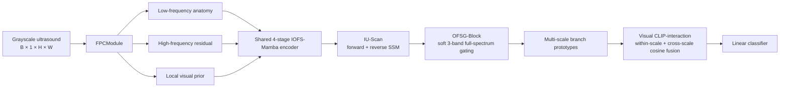

# FI-Mamba

This repository contains the official implementation of the paper:

**"FI-Mamba: Frequency-Domain Lossless Mamba with Prior Collaboration, Isotropic Unbiased State-Space Learning and Multi-Scale CLIP for Perinatal Brain Ultrasound Image Classification"**

## Overview

Perinatal brain ultrasound classification is challenging because subtle ventricular abnormalities coexist with speckle noise, weak boundaries, view-dependent appearance, and strong left-right anatomical symmetry. FI-Mamba addresses these factors with four coupled components:

1. **Frequency-Prior Collaborative Module (FPCModule).** A reconstructable Laplacian-residual decomposition separates low-frequency anatomy and high-frequency detail without discarding either component. A local difference prior emphasizes diagnostically relevant boundaries.
2. **Isotropic Unbiased Scan (IU-Scan).** Forward and reverse selective state-space updates are adaptively fused to reduce the directional bias caused by flattening a two-dimensional image into a one-dimensional token sequence.
3. **Orthogonal Frequency Spectrum Gating Block (OFSG-Block).** The complete spectrum is organized into three complementary soft bands whose masks sum to one. Multi-window local amplitudes and content-adaptive gates suppress non-diagnostic responses while retaining a residual information path.
4. **Multi-scale multi-head CLIP-interaction.** CLIP-style normalized cosine interaction is reinterpreted as a pure-vision operation. It aligns low-frequency, high-frequency, and prior branches across four encoder stages without requiring a text encoder or paired reports.

